# saliency-benchmark
Repository for benchmarking different post-hoc XAI explanation methods on image datasets.

## Install and Usage
To install and use the project, follow the step explained in the [documentation](docs/README.md).

For a rapid trial, you can fine the extracted masks, the saliency maps computed for each method, the checkpoints of the trained models and the necessary probabilities for weight of evidence computation in the drive at the following [link](https://drive.google.com/drive/folders/1wjHDtH7-IyGBJVbL-XrJ14B5YB9azHmU?usp=sharing) 

## Prediction and saliency map

#### ResNet model

| Prediction | Image                                             | GradCAM                                                | LIME                                                | RISE                                                | SIDU                                                |
|------------|---------------------------------------------------|--------------------------------------------------------|-----------------------------------------------------|-----------------------------------------------------|-----------------------------------------------------|
| Golf ball  | 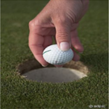 |  | 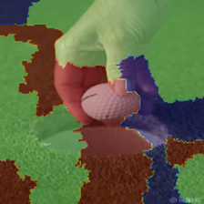 | 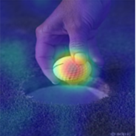 | 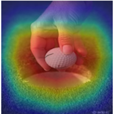 |
| Glacier    | 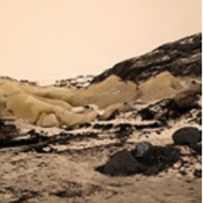   | 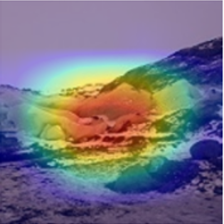 | 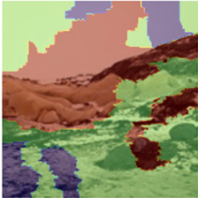 | 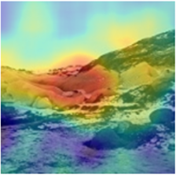 | 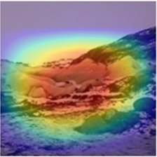 |

#### VGG model

| Prediction | Image                                             | GradCAM                                                  | LIME                                                | RISE                                                | SIDU                                                |
|------------|---------------------------------------------------|----------------------------------------------------------|-----------------------------------------------------|-----------------------------------------------------|-----------------------------------------------------|
| Golf ball  |  | 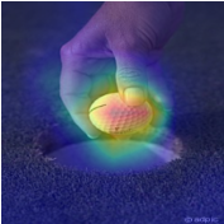 | 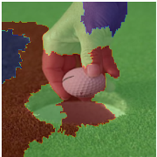 | 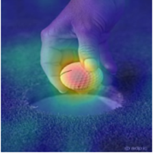 | 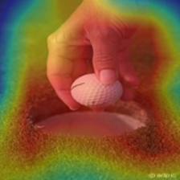 |
| Glacier    |    | 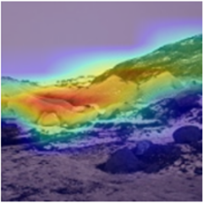   | 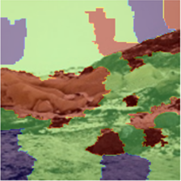 | 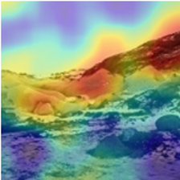 | 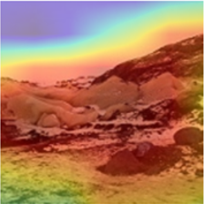 |

## Alignment between human concepts and explainable deep learning models

|    Original Image                                             | Saliency map                                                                                                                                                   | Concepts  extracted                 | Saliency + Concepts |
|---------------------------------------------------------------|----------------------------------------------------------------------------------------------------------------------------------------------------------------|------------------------------------------------------|---------------------|
|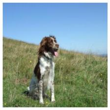 | 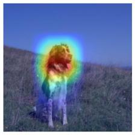 | 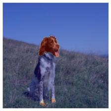 |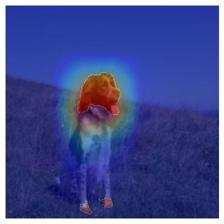 
